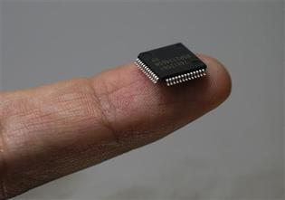
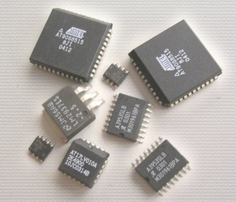

.. slide:: middleSlide

Architecture
============

.. slide::

Introduction
------------

.. center::
    .. image:: img/woz.jpg

.. textOnly::
    Les premiers ordinateurs ont suivi l'arrivée des microprocesseurs au début
    des années 1970. Les capacités de ces derniers étaient loin de la puissance
    des ordinateurs modernes, mais il était possible de savoir TOUT ce que
    contenait votre machine et comment elle fonctionnait.

.. slide::

Loi de Moore
~~~~~~~~~~~~

.. center::
    .. image:: img/moore.png

.. textOnly::
    La loi empirique de Moore établit que la densité de transistors dans un ordinateur
    double environ tous les deux ans à budget égal.

.. slide::

.. center::
    .. image:: img/cloud.jpg

.. textOnly::
    L'évolution technologique qui nous a conduit a la situation actuelle
    a empilé des couches d'abstractions qui nous permettent de profiter
    d'un environnement riche et facile d'accès.

    Cependant, un informaticien moderne est peu averti du fonctionnement
    du matériel au plus bas niveau.

.. slide::

Loi de Wirth
~~~~~~~~~~~~

.. important::
    Software is getting slower more rapidly than hardware becomes faster.

Loi de May
~~~~~~~~~~

.. important::
    Software efficiency halves every 18 months, compensating Moore's law.

.. slide::

Désenchantement logiciel
-------------------------

`Article original <https://medium.com/@rfallet/desenchantement-logiciel-ffba8eef7b8a>`_

.. discoverList::

    * Le logiciel est **lent**
        * Windows 10 met **30 minutes** à se mettre à jour ...
        * ... dans le même temps, on aurait réécrit **5 fois le SSD entier**
        * Pourquoi un téléphone met **30 à 60 secondes à démarrer** ?
    * Le logiciel est **énorme**
        * Windows 95 pesait **30 Mo** ...
        * ... l'application clavier de Google (Android) consomme **150 Mo**
    * Le logiciel est **vite obsolète**

.. slide::

.. center::
    .. image:: /img/python_vs_rust.png
        :width: 750

.. slide::

.. center::
    .. image:: /img/xkcd_soft.gif

.. slide::

.. center::
    .. image:: /img/xkcd_abstraction.png
        :width: 750

.. slide::

Qu'est-ce qu'un système embarqué?
~~~~~~~~~~~~~~~~~~~~~~~~~~~~~~~~~

Dans le cadre de ce cours, un système embarqué sera:

.. discoverList::
* Composé d'au moins une puce programmable
* Petit, ce qui implique des difficultés
  * D'encombrement
  * De puissance
  * De performance
  * De temps réel

.. slide::

Du silicium au programme
------------------------

.. textOnly::
    Les circuits intégrés (puces électroniques) sont la base de toute
    architecture matérielle embarquée. Ils sont construits à partir de
    galettes nommées **wafers**.

.. center::
    .. image:: img/insolation.png

.. textOnly::
    Ces galettes sont principalement traitées par photolithographie à l'aide
    de masques optiques afin de reproduire des motifs qui formeront les
    composants (transistor, diode, résistance ...)

.. slide::

.. center::
    .. image:: img/wafer.jpg

.. textOnly::
    Ces morceaux de silicium sont alors packagés dans des boîtiers qui pourront
    être assemblés sur des cartes électroniques.

.. slide::

.. center::
    .. image:: img/ic.jpg

.. slide::

.. center::
    .. image:: img/pcb.jpg

.. slide::

Les CIs
~~~~~~~

Il existe plusieurs genres de circuits intégrés:

* Les processeurs (CPU)
* Les microcontrôleurs (MCU)
* Les ASIC/ASSP
* Les DSP
* Les FPGA

.. textOnly::
    Nous nous concentrerons sur ceux qui sont programmables, mais nous utiliserons
    divers circuits intégrés par la suite.

.. slide::

Programmation de microcontrôleurs
---------------------------------

Mémoire
~~~~~~~

Il existe plusieurs formes de mémoire:

* La RAM
* La flash (ROM)
* L'EEEPROM

.. slide::

Registres
~~~~~~~~~

Un processeur contient également des **registres**, qui sont
des "cases" particulières de la mémoire ayant un effet sur le comportement
du processeur ou du hardware.

.. center::

    .. image:: img/atmega-regs.png

.. slide::

Les éléments (registres, mémoire vive, morte...) présents sur le bus ou non sont
en général accessibles via des **adresses**.

.. slide::

.. center::
    .. image:: img/atmega-archi.png

.. slide::

Instructions binaires, assembleur
~~~~~~~~~~~~~~~~~~~~~~~~~~~~~~~~

Le coeur du processeur déchiffre les instructions et exécute les actions en
conséquence.

.. discover::
    Ces instructions sont appelées langage machine (opcodes).

.. discover::
    Afin de pouvoir représenter ces opérations, on utilise des mnémoniques,
    qui représentent le langage assembleur.

.. slide::

Chargement du programme
~~~~~~~~~~~~~~~~~~~~~~~

Les micro-contrôleurs proposent en général plusieurs manières d'être programmés en
sortie d'usine (JTAG, SPI, série...)

.. discover::
    Les cartes de développement sont fréquemment équipées d'un programme permettant
    lui-même de les reprogrammer. C'est ce que l'on appelle un **bootloader**.

.. slide::

Compilation depuis C
~~~~~~~~~~~~~~~~~~~~

**Cross-compilation**

Lorsque nous travaillerons sur des petits binaires, nous allons utiliser
la **cross-compilation**, c'est à dire que nous compilerons pour une
autre architecture que notre ordinateur.

Pour cela, il suffit de disposer de la chaîne de compilation adéquate.

.. slide::

**Binaires**

Afin de programmer un micro-contrôleur, il faut produire un binaire "brut",
et non pas un fichier ELF/binaire exécutable comme vous avez l'habitude.

A bord de la cible, il n'y a pas de système d'exploitation, ce qui veut dire
pas d'ordonnancement, pas d'espace utilisateur/noyau, pas d'appel système etc.

.. slide::

**Optimisations**

Il est nécessaire d'activer les **optimisations** du compilateur pour
travailler sur des micro-contrôleurs. Typiquement ``-Os``:

.. code-block:: bash

    gcc -Os code.c

.. textOnly::
    Cette option demande au compilateur de réduire au plus possible la
    taille du fichier produit.

.. slide::

**Registres**

.. textOnly::
    On retrouvera en général ce genre de notations:

.. code-block:: cpp
    #define REG (*(volatile uint8_t *)(0xf00))

    int main(void) {
        REG = 123;
    }

.. textOnly::
    Afin d'accéder à un registre. Le mot clé ``volatile`` permet au compilateur
    de savoir qu'il faut écrire dans cette variable (notamment d'éviter les optimisations
    qui pourraient y correspondre).

.. slide::

**Opérations binaires**

.. textOnly::
    Il existe plusieurs opérateurs importants à connaître pour manipuler les octets
    au bit près:

=============   ======================
**Opérateur**   **Signification**
=============   ======================
``&``           Et logique
=============   ======================
``|``           Ou logique
=============   ======================
``~``           Négation (inverse)
=============   ======================
``<<``          Décalage à gauche
=============   ======================
``>>``          Décalage à droite
=============   ======================

.. slide::

.. warning::
    **Attention**, il ne faut pas confondre l'opérateur ``&&`` et l'opérateur ``&``,
    tout comme il ne faut pas confondre ``||`` avec `|`.

    Ces derniers sont respectivement des opérateurs logiques (agissant sur des booléens)
    et binaires (agissant sur des entiers).

.. slide::

**Exemples**

Que fait cette macro?

.. code-block:: cpp

    #define _BV(n) (1<<(n))

.. slide::

Que fait ce bout de code?

.. code-block:: cpp

    PORTD |= _BV(3);

.. slide::

Et celui-ci?

.. code-block:: cpp

    PORTD &= ~_BV(3);

.. slide::

Et celui-ci?

.. code-block:: cpp

    PORTD &= ~(_BV(3) | _BV(4));

.. slide::

Et celui-ci?

.. code-block:: cpp

    if (PORTD & _BV(3)) {
        // ...
    }

.. textOnly::
    Il est important de maîtriser ces opérations binaires pour pouvoir facilement
    travailler sur des registres par la suite.

.. slide::

Un exemple: les broches d'ATmega
--------------------------------

.. textOnly::
    Dans la documentation officielle, on trouve l'utilisation des registres permettant
    de piloter les broches:

.. center::
    .. image:: img/ddr.png

.. slide::

.. textOnly::
    Sachant que, par exemple, un des boîtiers a cette forme:

.. center::
    .. image:: img/dip.png

.. slide::

Il sera possible de changer la valeur de la broche PB2 comme cela:

.. code-block:: cpp

    // En-têtes fournies par AVR pour les
    // registres
    #include <avr/io.h>

    int main() {
        // Paramètre en sortie
        DDRB |= _BV(PB5);
        // Définit la broche à "High"
        PORTB |= _BV(PB5);
    }

.. slide::

Voici le code assembleur qui correspondra à ces instructions::

      25 9a           sbi     0x04, 5 ; 4
      2d 9a           sbi     0x05, 5 ; 5
      08 95           ret

.. slide::

En amont, le compilateur ajoutera le préambule::

      11 24           eor     r1, r1
      1f be           out     0x3f, r1        ; 63
      cf ef           ldi     r28, 0xFF       ; 255
      d8 e0           ldi     r29, 0x08       ; 8
      de bf           out     0x3e, r29       ; 62
      cd bf           out     0x3d, r28       ; 61
      0e 94 40 00     call    0x80    ; 0x80 <main>
      0c 94 43 00     jmp     0x86    ; 0x86 <_exit>

.. slide::

Et l'épilogue::

        00000086 <_exit>:
          86:   f8 94           cli
        00000088 <__stop_program>:
          88:   ff cf           rjmp    .-2             ; 0x88 <__stop_program>

.. redirection-title:: tds/td1

TD
---

.. toctree::
    tds/td1
