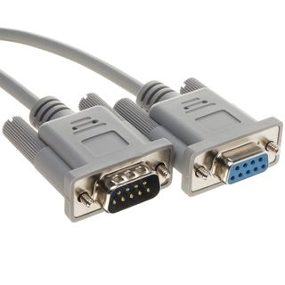

.. slide:: middleSlide

Les bus
=======

.. slide::

Présentation
------------

Le besoin d'avoir des protocoles communs pour faire dialoguer les CIs/composants
a donné naissance à certains bus standards.

.. slide::

Les lignes
~~~~~~~~~~

Avant de parler des bus, parlons du fonctionnement des différentes lignes électroniques.
Contrairement à la vision "informaticien", une ligne n'est pas simplement à "0" ou à "1",
elle est d'une part à un certain **niveau de voltage**, mais aussi à une certaine **impédance**.

.. slide::

Lorsqu'une ligne est pilotée par un contrôleur, elle est amenée en basse impédance à
un niveau logique ou à un autre. En général, peu de courant peuvent circuler à travers.

.. center::
    .. image:: img/drive.jpg

.. slide::

Un troisième état est la haute impédance, c'est à dire une connexion flottante. C'est
elle qui correspond par exemple au mode "entrée" de votre ATmega328p.

.. center::
    .. image:: img/tristate.png

.. textOnly::
    Certaines lignes sont cependant pilotées seulement par moment, et "relâchées" à d'autres,
    elles sont alors flottantes. On utilise en général une **résistance de tirage**, qui
    leur impose un niveau logique, on dit qu'elles sont en haute impédance.

.. slide::

.. center::
    .. image:: img/pull.jpg

.. slide::

.. textOnly::
    Une autre configuration que l'on trouve est le collecteur ouvert (ou drain ouvert), qui
    signifie qu'un transistor prêt à être fermé est attaché à cette broche.

.. center::
    .. image:: img/opencollector.png

.. slide::

Push/Pull vs Open collector
~~~~~~~~~~~~~~~~~~~~~~~~~~~

.. textOnly::
    On retrouve en général ces deux configurations: le push-pull (qui "drive" la ligne) ou
    l'open-drain

.. center::
    .. image:: img/pushpull.jpg
    .. image:: img/open-collector.jpg

.. slide::

Généralités
~~~~~~~~~~~

.. discoverList::
    * Niveau de voltage?
    * Analogique/Digital?
    * Synchrone ou asynchrone?
    * Full duplex ou *half duplex*?
    * Bande(s) passante(s)?
    * Robustesse?
    * Protocole?
    * Efficacité?

.. slide::

Les standards
-------------

UART
~~~~

Le port série est un des bus les plus célèbre et classique. Il s'agit d'une ligne
asynchrone (sans horloge). Cela sous-entend qu'il existe un accord sur le débit,
que l'on appelle en général *baud rate*.

.. discover::
    Les octets sont transmis bit après bit.

.. discover::
    Les octets sont fréquemment précédés d'un *start bit*, et suivi d'un *stop
    bit* qui permet de garder la ligne synchronisée même si on ne transmet que
    le même niveau logique.

.. slide::

**TTL**

La variante standard est d'utiliser deux fils (en plus de la masse), TX et RX.
Chaque contrôleur pilote sa broche TX et écoute RX. Le signal peut être de divers
niveaux de voltage, typiquement 5V ou 3.3V.

.. discover::
    Dans sa forme la plus standard, le bus série est full-duplex.

.. slide::

**RS-232**

Le RS-232 est une norme série standard utilisant des niveaux de voltage de -12V
et de 12V. Cette variante est half-duplex.

Le connecteur historique (photo ci-contre) se retrouve encore dans certains
produits.

.. discover::

    **RS-485**

    Le RS-485 est une autre norme half-duplex de la liaison série utilisant
    2 fils symétriques, la différence entre ces derniers devant être de -200mV
    ou de +200mV.

.. slide::

.. important::
    Il existe des baud rate typiques, les plus célèbres sont 9600, 57600,
    ou encore 115200
    L'UART se limite en général à quelques Mbit/s

.. slide::

I2C/TWI
~~~~~~~

I2C (Interface 2 Câbles), ou TWI (Two Wire Interface) est un type de bus qui
utilise deux fils (en plus de la masse), qui est synchrone et half-duplex.

.. discover::
    Les fils sont tirés vers V+ à travers des pull-up, et pilotés par des
    collecteurs/drains ouverts.

.. slide::

.. center::
    .. image:: img/i2c.png

.. slide::

.. textOnly::
    I2C se base sur un système d'adressage, et un protocole contenant des acquittements.

.. center::
    .. image:: img/i2c_protocol.jpg

.. slide::

Dans le cas ou plusieurs maîtres entameraient une trame exactement en même temps,
un arbitrage est réalisé en monitorant le niveau de la ligne (si LOW est lu alors
que HIGH est envoyé, la trame s'arrête).

.. slide::

.. important::
    Ce protocole est très répandu et utilisé, il est cependant en général limité à
    400kbit/s.
    Il existe cependant des variantes "fast" de l'I2C.

.. slide::

SPI
~~~

.. textOnly::
    Le SPI (Serial Peripheral Interface) est un bus full-duplex et synchrone. Sur
    un bus SPI est présent un maître et des esclaves.

    Il est en général composé de 4 fils:

    * **SCK**: L'horloge indiquant sur front montant ou descendant le moment ou un
      bit est transmis
    * **MOSI** et **MISO**: respectivement Master Output/Slave Input et Master Input/Slave
      Output, les lignes qui transmettent les données
    * **CS**: Le "Chip Select", qui indique à chaque périphérique si il est activé ou non

.. center::
    .. image:: img/spi.png

.. slide::

.. textOnly::
    Typiquement, le maître écrit une opération de lecture ou d'écriture sur sa ligne, puis
    continue éventuellement d'envoyer des coups d'horloge pour lire les données depuis
    l'esclave.

.. center::
    .. image:: img/spi_diagram.jpg

.. slide::

.. important::
    SPI est également très répandu, car il permet d'atteindre des grandes vitesses (plusieurs
    dizaines de Mbit/s).

.. slide::

CAN
~~~

Le protocole CAN est un protocole série, basé sur un accord préalable de rapidité (baud rate).
Il est très utilisé dans le monde industriel et automobile. Physiquement, il exploite deux lignes
CANH et CANL, et se base sur un état dominant et récessif.

.. textOnly::
    Il comporte un arbitrage, comme I2C, et les messages démarrent par un identifiant qui sert
    justement à ajuster la priorité. Chaque trame comporte également un somme de contrôle CRC.

.. slide::

.. center::
    .. image:: img/can.png

.. slide::

.. redirection-title:: tds/td2

TD
---

.. toctree::
    tds/td2
