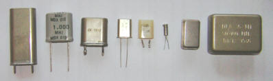

Les fonctionnalités
===================

.. slide::

Les GPIOs
---------

.. textOnly::
    Les GPIOs (General Purpose Input/Outputs) sont des broches que l'on peut piloter
    en lecture/écriture à notre guise.

    Cet exemple montre le schéma logique d'une broche d'ATmega, il est ici possible
    d'activer la broche en sortie et de la piloter au niveau haut ou bas (milieu du schéma),
    de l'échantilloner (bas du schéma) et d'y activer une pull-up (haut du schéma).

.. center::
    .. image:: img/atmega-pin.png

.. slide::

Les broches sont en général utilisable en GPIO et peuvent passer en mode alternatif,
étant alors gérée par une fonctionnalité du contrôleur (pensez par exemple à l'UART).

.. slide::

DAC
---

Le DAC (Ou CNA) est une conversion numérique vers analogique, elle permet à partir d'une
valeur constituée de plusieurs bits en mémoire (par ex de 0 à 1023) de créer une valeur 
représentée par un niveau de voltage (par ex. de 0 à 5V).

.. slide::

**PWM-DAC**

.. textOnly:: 
    La première solution consiste en un signal périodique qui est ensuite passé dans
    un filtre passe bas, donnant alors un signal analogique "moyenné".

.. center::
    .. image:: img/pwm_dac.jpg

.. slide::

**Thermometer DAC**

.. textOnly:: 
    Une autre méthode est la méthode du thermometre, qui se compose d'une chaîne de
    résistances, avec un aiguillage permettant de diriger un des points du réseau
    vers la sortie. Cette solution donnera des résultats précis, mais est extremement
    coûteuse, il faut en effet un réseau d'autant d'éléments que de valeur qu'il
    est possible de prodfuire.

.. center::
    .. image:: img/thermometer.gif

.. slide::

**R2R DAC**

.. textOnly:: 
    Enfin, le R2R ladder (échelle R/R2) est une combinaison de résistances permettant
    de combiner plusieurs bits afin de réaliser la valeur analogique voulue:

.. center::
    .. image:: img/r2r.png

.. slide::

ADC
---

L'ADC (ou CAN) est l'opération inverse du DAC, qui consiste à échantilloner un niveau de 
voltage pour obtenir une valeur numérique.

Le design d'un ADC est souvent proche du design dual DAC, en comparant le voltage avec l'entrée
à échantilloner.

.. slide::

.. center::
    .. image:: img/adc_flash.png

.. textOnly::
    Par exemple, l'ADC "flash" (ci-dessus) est le dual du DAC thermomètre, en contenant
    toutes les possibilités de voltage mesurables.

.. slide::

Interruptions
-------------

Considérons le code suivant:

.. code-block:: c

    void uart_send(char *str) {
        while (*str != '\0') {
            while (UCSR0A & _BV(UDRE0));
            UDRE0 = *(str++);
        }
    }

.. vi fix*

.. slideOnly::
    .. discoverList::
    * Imaginons que nous soyons à 9600 bauds, avec 1 bit start
      et 1 bit stop
    * Combien de temps faudrait t-il pour executer ``uart_send("Bonjour");``?
    * Sur un micro-contrôleur à 16Mhz, à combien de cycle cela correspond?

.. textOnly::
    Ce code est fonctionnel, mais très gourmand en resources, car il occupera
    le processeur pendant environ 6.5ms (soit plus de 100000 cycles sur un processeur
    à 16Mhz).

.. slide:: 

.. discover::
    Les interruptions sont des mécanismes "événementiel": le processeur va "sauter" à 
    une adresse sur certaines conditions.

.. textOnly::
    Le code binaire que l'on placera sur un micro contrôleur commencera par une table
    des interruptions. A chaque case de cette table, on trouvera l'adresse à laquelle il faut
    se rendre si une interruption donnée se déclenche.

.. slide::

.. center::
    .. image:: img/interrupts.png

.. slide::

Par exemple, la récéption d'un octet sur l'USART pourra déclencher l'appel à du
code utilisateur, ce qui permet d'éviter de "scruter" pour vérifier si un octet a
été reçu.

Cette version, dite en scrutation:

.. code-block:: c
    while (!(UCSR0A&_BV(RXC0)));
    // Reception de l'octet

Sera plus flexible en utilisant l'interruption correspondante:

.. code-block:: c
    // Active l'interruption à la réception
    UCSR0B |= _BV(RXCIE0); 
    ...
    ISR(USART_RX_vect) {
        // Reception de l'octet
    }

.. vi fix =|

.. slide::

.. warning::
    **Attention** 
    Le fait d'être dans une interruption bloque l'arrivée des autres
    interruptions (selon une politique plus ou moins sophistiquée). Le code d'une
    interruption est en général court et simple (stocker un octet dans un tableau,
    passer un flag à vrai etc.).

.. slide::

Timers
------

Le temps est basé sur un composant de base nommé le **quartz** qui génère un signal
périodique à une fréquence précise.

.. discover::
    Cette horloge peut être accélérée (à l'aide de PLL) ou réduite (à l'aide de divider
    ou de prescaler).

.. slide::

Fonctionnement
~~~~~~~~~~~~~~

Un timer est une fonctionnalité configurable, qui aura pour effet d'incrémenter un registre
à une certaine fréquence.

.. discover::
    Lorsque ce registre atteindra sa valeur maximale, il repartira à 0, c'est le dépassement
    (*overflow*).

.. discover::
    C'est en général à ce moment là qu'une interruption peut avoir lieu, pour déclencher un
    événement périodique.

.. slide::

PWM
~~~

Un timer est souvent accompagné d'un module permettant de générer des PWM hardware.

Dans ce cas, l'état d'une broche peut être modifiée selon l'état du timer, et ce 
automatiquement par le microcontrôleur.

.. slide::

.. center::
    .. image:: img/fast_pwm_example.png

.. slide::

DMA
---

Les interruptions permettent d'alléger la plupart des opérations standards, telles
que l'envoi/réception de données.

Imaginez, sur un contrôleur à 16mhz une interruption qui:

* Est levée à chaque octet reçu sur un bus à 1 méga bauds
* Dure 64 cycles 

.. slideOnly::
    .. discover::
    * Combien de temps s'écoule entre chaque interruption?
    * Combien de temps dure une interruption?

.. textOnly::
    Un tel système serait interrompu en permanence, car l'interruption
    durerait 8µs et serait executée environ toutes les 8µs.

.. slide::

Une solution: le DMA (Direct Memory Access), qui est disponible sur un grand nombre
de processeur (mais pas l'ATmega par exemple). 

.. discover::
    Le principe: configurer un système qui agira directement sur le bus mémoire, comme
    le ferait le processeur, mais en exécutant des actions simples et répétitives. 

.. discover::
    Par exemple, le DMA peut récupérer des données depuis un port série et les écrire
    directement dans un buffer en mémoire.

.. slide::

MMU
---

