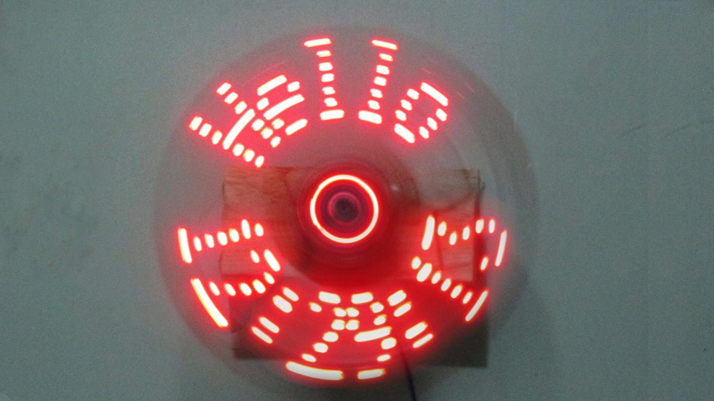

Projet: afficheur à persistence rétinienne
==========================================

Dans ce projet, une carte électronique sur mesure ainsi que la mécanique
qui va avec vous seront fournis.

.. center::
    .. youtube:: CmLTSX6W8rg

.. important::
    `Télécharger le schéma de la carte </files/pov.pdf>`_

#=) Prise en main du matériel
~~~~~~~~~~~~~~~~~~~~~~~~~~~~~

#~) Programmation
-------------------------------------

La carte comporte un processeur sorti d'usine, il n'y a pas de bootloader
logiciel dessus, uniquement les bootloader hardware. Vous devrez pour le
programmer utiliser un boîtier ISP.

Indications pour avrdude: ``-c avrisp2 -P usb``

Tout d'abord, prenez en main cette manière de programmer la puce.

#~) Communication série
-----------------------

La carte est équipée d'une puce bluetooth HC-05. Pour communiquer avec, vous
aurez besoin d'avoir un port série fonctionnel sur votre carte, et de la configurer
de la bonne manière.

La mise en place de cette communication série avec la carte est vitale pour
pouvoir dialoguer avec la carte pendant qu'elle tourne, et ainsi débugger ou pouvoir
la contrôler.

Un numéro est gravé sur l'arrière de votre carte, il correspond à votre numéro de
groupe. La puce Bluetooth a déjà été configurée avec les paramètres:

    Nom: POV**N**
    Pin: 000**N**
    Baud rate: 38400

Où N est votre numéro de groupe

#~) Pilotage des LEDs
---------------------

Comme vous pouvez le voir sur le schéma, la carte est équipée de 16 LEDs et
d'une puce qui permet de les piloter en courant.

Vous devez implémenter le code permettant d'allumer et d'éteindre ces LEDs.

#~) Capteur magnétique
----------------------

Le capteur magnétique de la carte permet de détecter la présence d'un aimant.
Testez-le en vérifiant que vous arrivez bien à différencier le cas où il est
devant l'aimant et où il n'est pas devant l'aimant.

Désormais, programmez une interruption pour qu'une fonction soit automatiquement
appelée lorsque vous passerez devant l'aimant.

#~) Calcul de l'heure
----------------------

À l'aide de timers, vous devez être capable de calculer l'heure courante. Pour
améliorer les tests, les minutes seront remplacées par des secondes.

Vous devrez être en mesure de définir l'heure courante en bluetooth depuis votre
ordinateur.

#=) Fonctionnalités
~~~~~~~~~~~~~~~~~~~

.. warning::

    Note: gardez la possibilité de présenter tous les modes ci-dessous à la soutenance

#~) Affichage horloge à aiguilles
---------------------------------

Vous avez maintenant tous les éléments pour pouvoir programmer votre horloge.
Le but ici est d'afficher l'heure avec des "aiguille" en LEDs.

#~) Horloge numérique numérique arrondie
----------------------------------------

Affichez l'heure avec des nombres, sans compenser la distorsion de
la rotation, comme ceci:

#~) Affichage horloge numérique générique
-----------------------------------------

Essayez ensuite de compenser la distorsion pour avoir une heure
"droite", ayant ainsi un afficheur générique:

