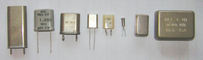

Timers et ADC
=============

.. slide::

DAC
---

Le DAC (Ou CNA) est une conversion numérique vers analogique, elle permet à partir d'une
valeur constituée de plusieurs bits en mémoire (par ex de 0 à 1023) de créer une valeur 
représentée par un niveau de voltage (par ex. de 0 à 5V).

.. slide::

**PWM-DAC**

.. textOnly:: 
    La première solution consiste en un signal périodique qui est ensuite passé dans
    un filtre passe bas, donnant alors un signal analogique "moyenné".

.. center::
    .. image:: img/pwm_dac.jpg

.. slide::

**Thermometer DAC**

.. textOnly:: 
    Une autre méthode est la méthode du thermomètre, qui se compose d'une chaîne de
    résistances, avec un aiguillage permettant de diriger un des points du réseau
    vers la sortie. Cette solution donnera des résultats précis, mais est extrêmement
    coûteuse, il faut en effet un réseau d'autant d'éléments que de valeur qu'il
    est possible de produire.

.. center::
    .. image:: img/thermometer.gif

.. slide::

**R2R DAC**

.. textOnly:: 
    Enfin, le R2R ladder (échelle R/R2) est une combinaison de résistances permettant
    de combiner plusieurs bits afin de réaliser la valeur analogique voulue:

.. center::
    .. image:: img/r2r.png

.. slide::

ADC
---

L'ADC (ou CAN) est l'opération inverse du DAC, qui consiste à échantillonner un niveau de 
voltage pour obtenir une valeur numérique.

Le design d'un ADC est souvent proche du design dual DAC, en comparant le voltage avec l'entrée
à échantilloner.

.. slide::

.. center::
    .. image:: img/adc_flash.png

.. textOnly::
    Par exemple, l'ADC "flash" (ci-dessus) est le dual du DAC thermomètre, en contenant
    toutes les possibilités de voltage mesurables.

.. slide::

Dans l'Atmega328p, l'ADC est basé sur des comparaisons successives avec les valeurs d'un DAC utilisé
en interne:

.. center::
    .. image:: img/atmega_dac.png

.. slide::

Timers
------

Le temps est basé sur un composant de base nommé le **quartz** qui génère un signal
périodique à une fréquence précise.

.. discover::
    Cette horloge peut être accélérée (à l'aide de PLL) ou réduite (à l'aide de *divider*
    ou de *prescaler*).

.. slide::

Fonctionnement
~~~~~~~~~~~~~~

Un timer est une fonctionnalité configurable, qui aura pour effet d'incrémenter un registre
à une certaine fréquence.

.. discover::
    Lorsque ce registre atteindra sa valeur maximale, il repartira à 0, c'est le dépassement
    (*overflow*).

.. discover::
    C'est en général à ce moment là qu'une interruption peut avoir lieu, pour déclencher un
    événement périodique.

.. slide::

PWM
~~~

Un timer est souvent accompagné d'un module permettant de générer des PWM hardware.

Dans ce cas, l'état d'une broche peut être modifiée selon l'état du timer, et ce 
automatiquement par le microcontrôleur.

.. slide::

.. center::
    .. image:: img/fast_pwm_example.png

.. slide::

.. redirection-title:: tds/td4

TD
---

.. toctree::
    tds/td4
